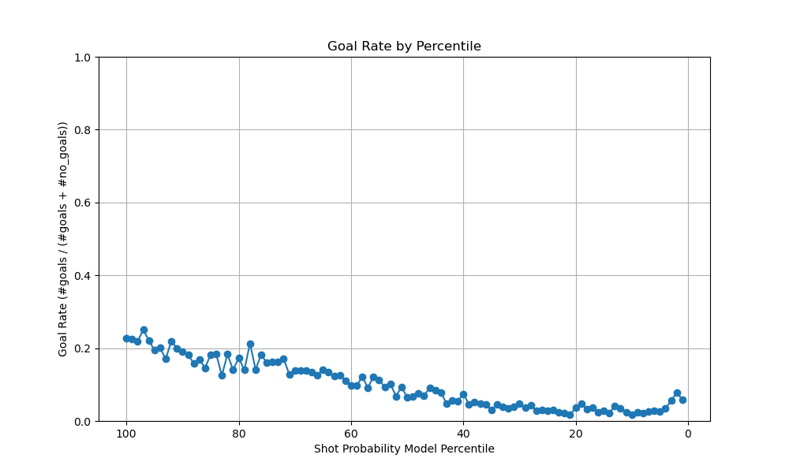

_Contents_ :  
- [2. Feature Engineering I](#section2)  
    - [2.1.1 Histogram of shot counts by distance](#section2.1.1) 
    - [2.1.2 Histogram of shot counts by angle](#section2.1.2) 
    - [2.1.3 2D Histogram by distance and angle](#section2.1.3)
    - [2.2.1 Goal Rate to the Distance of the Shot](#section2.2.1)
    - [2.2.2 Goal Rate to the Angle of the Shot](#section2.2.2)
    - [2.3 Comparative Analysis of Goals by Distance: Empty Net vs. Non-Empty Net](#section2.3)

- [3. Baseline Models ](#section3)
    - [3.1 Logistic Regression classifier with the completely default settings](#section3.1)
    - [3.3.1 Logistic Regression, trained on distance only](#section3.3.1)
    - [3.3.2 Logistic Regression, trained on angle only](#section3.3.2)
    - [3.3.1 Logistic Regression, trained on distance and angle](#section3.3.3)
    - [3.3.4 Random Baseline ](#section3.3.4)

- [4. Feature Engineering II](#section4)
    - [4.5 List of added features](#section4.5)

- [5. Advanced Models ](#section5)
    - [5.1 XGBoost classifier with Distance and Angle](#section5.1)
    - [5.2 Best XGBoost classifier with all added features](#section5.2)
    - [5.3 XGBoost classifier with feature selection](#section5.2)

- [6. Best Shot ](#section6)
    - [6.1 Models testing](#section6.1)
        - [6.1.1 Model#1: Neural Network](#section6.1.1)
        - [6.1.2. Model#2: Naive Bayes](#section6.1.2)
        - [6.1.3. Model#3: Decision Tree](#section6.1.3)
        - [6.1.4. Conclusion](#section6.1.4)
    
- [7. Evaluate on test set  ](#section7)
    - [7.1 Results on 2020/21 regular season dataset](#section7.1)
    - [7.2 Results on 2020/21 playoff games dataset](#section7.2)
<a name="section2"></a>
# 2. Feature Engineering I

<a name="section2.1.1"></a>
## 2.1.1. Histogram of shot counts (goals and no-goals separated), binned by distance

The majority of shots are concentrated within 75 feet of the net, with a noticeable decline in attempts beyond this range. Goals are more frequent at shorter distances, highlighting the increased likelihood of scoring when players shoot closer to the net.

<a name="section2.1.2"></a>
## 2.1.2. Histogram of shot counts (goals and no-goals separated), binned by angle

The majority of shots are taken from angles between -45 and +45 degrees, it is explainable because players usually choose a small angle to aim for the net.The distribution of goals is skewed towards smaller angles. There's a clear peak in goal frequency around 0 degrees (directly in front of the net), indicating that shots taken from this angle are most likely to result in goals. In contrast, at larger angles the shots more likely resulting in no goals. And There are local peaks around +/- 30 degrees means but there are no corresponding peaks in the goals distributioncothat, it suggests that these shots are not particularly successful. The data highlights the importance of shooting from close range and directly in front of the net to maximize goal-scoring chances.
<a name="section2.1.3"></a>
## 2.1.3. 2D histogram where one axis is the distance and the other is the angle. 

The distribution reveals a dense cluster of shots within a distance range of 0–75 feet and an angle range of -25 to 25 degrees, indicating the most strategic regions for shot attempts. Beyond 75 feet or at angles exceeding ±50 degrees, the frequency of shots decreases significantly. This pattern reinforces the importance of both proximity and central alignment to the net for increasing scoring opportunities.

<a name="section2.2.1"></a>
## 2.2.1 Goal Rate to the Distance of the Shot

The goal rate is highest within the first 10 feet, showcasing a significant advantage for close-range shots. Beyond 10 feet, the goal rate declines sharply, indicating the diminishing effectiveness of longer-distance attempts. Interestingly, after approximately 50 feet, the goal rate stabilizes at a much lower level, with minor fluctuations observed. This pattern reflects the increased difficulty of scoring from longer distances due to factors such as goaltender preparedness, defensive positioning, and reduced shot accuracy. 

<a name="section2.2.2"></a>
## 2.2.2 Goal Rate to the Angle of the Shot

The goal rate peaks near angles close to 0°, indicating that shots taken directly in front of the net are most effective. As the angle deviates from 0° in either direction, the goal rate gradually decreases, reaching its lowest values at extreme angles (e.g., beyond ±75°). This pattern aligns with the expectation that shots taken from central positions have a higher probability of success due to the larger visible target area and reduced travel distance for the puck. 

<a name="section2.3"></a>
## 2.3. Comparative Analysis of Goals by Distance: Empty Net vs. Non-Empty Net

As we can see from the histogram, most non-empty-net goals occur within 25 feet, aligning with domain knowledge. Rare but valid goals **game `2018020944`** were observed at longer distances, including one exceeding 150 feet. However, an anomaly was identified in **game `2018020928`** during an overtime shootout. A goal was recorded with an x-coordinate of `-65`, suggesting it originated deep in the defensive zone, which is inconsistent with shootout mechanics. Upon reviewing the game video, it was confirmed this was a valid shootout goal, and the recorded x-coordinate was a metadata error. 

**Source:**

[Game: 2018020944, Vegas Golden Knights vs Winnipeg Jets (2-1) – May.20, 2018](https://www.youtube.com/watch?v=1vbyyQZw-xY)
[Game:2018020928, NHL Highlights | Bruins vs. Golden Knights - Feb 20, 2019 ](https://www.youtube.com/watch?v=Rkh87uTNSdw)

<a name="section3"></a>
# 3. Baseline Models 

<a name="section3.1"></a>
## 3.1  Logistic Regression classifier with the completely default settings
The logistic regression model achieved a validation accuracy of 90.54% using only the `distance` feature. While this suggests that distance is a strong predictor of goals, the high accuracy is likely inflated due to the significant **class imbalance**, with `non-goal events` dominating the dataset. The model accurately predicts most non-goals but struggles with goal events, incorrectly classifying closer shots as non-goals. This highlights the model’s bias toward the majority class, achieving high accuracy by prioritizing non-goal predictions.

The reliance on a single feature and the use of default parameters further limit the model's performance. Distance alone cannot capture important factors like shot angle, shot type, or goalie positioning, and default logistic regression does not account for class imbalance. 

<a name="section3.3.1"></a>
## 3.3.1 Logistic Regression, trained on `distance` only 
[wandb:Logistic Regression with Distance only](https://wandb.ai/IFT6758_2024-B01/logistic_regression_comparison/runs/8xx3kiqn)
<div style="display: flex; justify-content: space-around; align-items: center;">
  
  
</div>
<div style="display: flex; justify-content: space-around; align-items: center;">
  
  
</div>
The logistic regression model trained on distance alone demonstrates moderate predictive power with an `AUC of 0.69`, performing better than random but lacking strong discrimination. The `goal rate` decreases with lower percentiles, indicating the model assigns higher probabilities to shots more likely to result in goals, though some inconsistencies are present. The `cumulative goals curve` shows the model effectively ranks shots by likelihood, capturing more goals at higher percentiles. However, the `reliability diagram` highlights poor calibration, with predicted probabilities often misaligned with actual outcomes. Overall, distance alone provides **limited predictive capability**, suggesting the need for additional features like angle to improve performance.


<a name="section3.3.2"></a>
## 3.3.2 Logistic Regression, trained on `angle` only 
[wandb:Logistic Regression with angle only ](https://wandb.ai/IFT6758_2024-B01/logistic_regression_comparison/runs/r5i3tkl8)
<div style="display: flex; justify-content: space-around; align-items: center;">
  
  
</div>
<div style="display: flex; justify-content: space-around; align-items: center;">
  
  
</div>
The logistic regression model trained on angle alone shows no predictive power, with an `AUC of 0.50`, equivalent to random guessing. The `goal rate` by percentile remains flat, indicating the model cannot differentiate between goals and non-goals based on angle. Similarly, the `cumulative proportion of goals` increases linearly, further confirming the model's inability to rank shots effectively. The `reliability diagram` highlights poor calibration, with predicted probabilities misaligned with actual outcomes. Overall, the angle feature alone provides **no meaningful contribution** to goal prediction, emphasizing the need for additional features to improve performance.


<a name="section3.3.3"></a>
## 3.3.3 Logistic Regression, trained on `distance and angle`
[wandb:Logistic Regression with Distance and Angle](https://wandb.ai/IFT6758_2024-B01/logistic_regression_comparison/runs/c67n3jt4)
<div style="display: flex; justify-content: space-around; align-items: center;">
  
  
</div>

<div style="display: flex; justify-content: space-around; align-items: center;">
  
  
</div>
The logistic regression model trained on both distance and angle achieves an `AUC of 0.69`, identical to the model trained on distance alone, suggesting that adding angle does not significantly enhance the model's discriminatory power. The `goal rate by percentile` indicates that the model assigns higher probabilities to goals at higher percentiles, though inconsistencies persist in the ranking of shots. The `cumulative proportion of goals` curve shows a steady increase, indicating the model effectively ranks shots but performs similarly to the distance-only model. The `reliability diagram` reveals poor calibration, with predicted probabilities not well-aligned with actual goal frequencies. Overall, combining distance and angle does **not significantly improve predictive performance**, underscoring the need for more informative features to better model goal-scoring likelihood.

<a name="section3.3.4"></a>
## 3.3.4 Random Baseline 
<div style="display: flex; justify-content: space-around; align-items: center;">
  
  
</div>
<div style="display: flex; justify-content: space-around; align-items: center;">
  
  
</div>
The random baseline model, which assigns probabilities uniformly between 0 and 1, achieves an `AUC of 0.50`, representing no predictive power and purely random guessing. The `goal rate` by percentile remains flat across all percentiles, indicating that the model cannot distinguish between goals and non-goals. The `cumulative proportion of goals` curve rises linearly, confirming that the random baseline is ineffective in ranking shots by their likelihood of being goals. The `reliability diagram` also reflects poor calibration, with predicted probabilities failing to align with actual outcomes. This result **serves as a benchmark**, demonstrating the minimum level of performance and providing a reference point for evaluating more sophisticated models.


<a name="section3"></a>
# 4. Feature Engineering II

<a name="section3.5"></a>
Building on the features from the initial phase of feature engineering, the following additional features were introduced to enrich the dataset:


You can access the filtered DataFrame(game_id:2017021065) for Winnipeg vs Washington game on March 12, 2018 [here]( https://wandb.ai/IFT6758_2024-B01/ms2_2017021065/artifacts/dataset/wpg_v_wsh_2017021065/v0).

<a name="section5"></a>
# 5. Advanced Models 

<a name="section5.1"></a>
## 5.1 XGBoost classifier with `Distance and Angle`
[wandb: XGBoost classifier with Distance and Angle](https://wandb.ai/IFT6758_2024-B01/ms2-xgboost-models/runs/8vfkgvs7)
<div style="display: flex; justify-content: space-around; align-items: center;">
  
  
</div>

<div style="display: flex; justify-content: space-around; align-items: center;">
  
  
</div>
The XGBoost classifier achieved an `AUC of 0.71`, slightly improving upon the logistic regression baseline (AUC = 0.69). The ROC curve shows better discrimination between goals and non-goals. The `cumulative proportion of goals` curve demonstrates that XGBoost `captures goals more effectively` at higher percentiles compared to logistic regression, highlighting improved ranking ability. The `reliability diagram` indicates slightly better calibration, though deviations from the perfect calibration line remain. Overall, XGBoost outperforms logistic regression.

<a name="section5.2"></a>
## 5.2  Best XGBoost classifier with all added features
[wandb: Best XGBoost classifier with all added features](https://wandb.ai/IFT6758_2024-B01/ms2-xgboost-models/runs/g6qlwty2)
<div style="display: flex; justify-content: space-around; align-items: center;">
  
  
</div>
<div style="display: flex; justify-content: space-around; align-items: center;">
  
  
</div>
The best XGBoost model `(AUC = 0.76)` outperforms the baseline (AUC = 0.71) in distinguishing goals from non-goals, with `sharper declines in goal rate` by percentile and a `steeper cumulative proportion curve`, capturing more goals in the top-ranked shots. Additionally, the `reliability diagram` of the best model shows improved calibration, with predicted probabilities aligning more closely with actual outcomes, while the baseline demonstrates greater deviation from perfect calibration. 

<a name="section5.3"></a>
## 5.3 XGBoost classifier with feature selection
Feature selection was conducted by ranking features based on three metrics: **gain, cover, and weight,** which measure a feature's contribution to reducing the loss function, the number of observations affected by splits, and the frequency of splits involving the feature, respectively. 

First, we enumerated the features as follows for easier analysis. One-hot encoded features (shot_type and last_event_type) were excluded from rankings to avoid bias: 

```python

features = [
    'distance_from_net', # f0
    'angle_from_net', # f1  #
    'game_seconds', # f2  #
    'period', # f3  ###
    'x_coord', # f4  ###
    'y_coord', # f5
    'angle_from_net', # f6  #
    #'shot_type', # comment this out when selecting features
    #'last_event_type', # comment this out when selecting features
    'last_x_coord', # f7  ###
    'last_y_coord', # f8  ##
    'time_from_last_event', # f9
    'distance_from_last_event', # f10  ##
    'rebound', # f11
    'change_in_shot_angle', # f12  ###
    'speed' # f13  ##
]

```
Next, we conducted the experiment by calculating feature importance using gain, cover, and weight scores. Features consistently ranked below the top six in all three metrics were eliminated. Here are the scores for each feature:

<div style="display: flex; justify-content: space-around; align-items: center;">
  
  
  
</div>

The features eliminated during the selection process were `period (f3)`, `x_coord (f4)`, `last_x_coord (f7)`, and `change_in_shot_angle (f12)`.
The final retained feature set is :
```python

features = [
    'distance_from_net', # f0
    'angle_from_net', # f1
    'game_seconds', # f2
    'y_coord', # f5
    'angle_from_net', # f6
    'shot_type', 
    'last_event_type',
    'last_y_coord', # f8
    'time_from_last_event', # f9
    'distance_from_last_event', # f10 
    'rebound', # f11
    'speed' #f13
]

```

The XGBoost performance with the selected features: 

[wandb: XGBoost with Selected Features](https://wandb.ai/IFT6758_2024-B01/ms2-xgboost-models/runs/9jkq9jtx)
<div style="display: flex; justify-content: space-around; align-items: center;">
  
  
</div>
<div style="display: flex; justify-content: space-around; align-items: center;">
  
  
</div>

The XGBoost model with selected features (AUC = 0.76) outperforms the `baseline model using only distance and angle` (AUC = 0.71), demonstrating improved predictive power. The selected feature model achieves a sharper decline in goal rate by percentile and a steeper cumulative proportion curve, effectively capturing more goals in top-ranked predictions. Additionally, it shows better calibration in mid-to-high probability ranges, refining probability estimates compared to the baseline. These results highlight the value of incorporating diverse features, enabling the model to capture complex patterns and significantly enhance performance.

Compared with the `best XGBoost classifier with all added features`, the XGBoost model with selected features achieves similar predictive performance and ranking ability as the best model with all features. The main difference lies in the reliability diagram, where the selected feature model deviates more noticeably from the perfectly calibrated line in mid-to-high probability ranges compared to the best model with all features. This suggests that the selected feature model is slightly less well-calibrated, likely due to the absence of some features that might help refine probability estimates.

**Source:**
[Feature Importance and Feature Selection With XGBoost in Python](https://machinelearningmastery.com/feature-importance-and-feature-selection-with-xgboost-in-python/)

<a name="section6"></a>
# 6. Best Shot

<a name="section6.1"></a>
## 6.1 Models testing
We use the following features to test models, we removed the `last_x_coord` and `last_y_coord` that are redundant with the `distance_from_last_event`, and that `angle_from_net` is redundant from `y_coord` and `x_coord`.

```python

features = [
        'distance_from_net',
        'angle_from_net',
        'game_seconds',
        'period',
        'x_coord',
        'y_coord',
        'shot_type',
        'last_event_type',
        'time_from_last_event',
        'distance_from_last_event',
        'rebound',
        'change_in_shot_angle',
        'speed'
    ]
```

<a name="section6.1.1"></a>
**6.1.1. Model#1: Neural Network**

[wandb:Neural Network](https://wandb.ai/IFT6758_2024-B01/ms2-neural-network/runs/8wwa9nx4)
<div style="display: flex; justify-content: space-around; align-items: center;">
  
  
</div>
<div style="display: flex; justify-content: space-around; align-items: center;">
  
  
</div>
The neural network achieves an **AUC of 0.76**, comparable to the best XGBoost model, indicating strong predictive power. The goal rate by percentile shows a **consistent decrease** as probabilities decline, reflecting effective ranking of shots by goal likelihood. The cumulative proportion of goals curve **rises steeply** at higher percentiles, capturing a large fraction of goals within the top-ranked shots, similar to XGBoost. However, in the reliability diagram, the neural network shows **notable deviations** from perfect calibration, particularly at mid-to-high probabilities, suggesting the model is overconfident in certain predictions. Overall, the neural network performs well but needs better calibration to improve probability alignment.

<a name="section6.1.2"></a>
**6.1.2. Model#2: Naive Bayes** 

[wandb:Naive Bayes](https://wandb.ai/IFT6758_2024-B01/ms2-naivebayes-models/runs/ziodph62)
<div style="display: flex; justify-content: space-around; align-items: center;">
  
  
</div>
<div style="display: flex; justify-content: space-around; align-items: center;">
  
  
</div>
The Naive Bayes model**(AUC = 0.68)** is significantly outperformed by the best XGBoost model with all features (AUC = 0.76). The best XGBoost achieves a much sharper decline in the Goal Rate by Percentile and a steeper Cumulative Proportion of Goals curve, capturing more goals efficiently in the top percentiles. Additionally, the Reliability Diagram shows that while Naive Bayes performs **well at lower probabilities**, the best XGBoost model offers better calibration overall, particularly in the mid-to-high probability range, despite minor overconfidence in higher probabilities.

<a name="section6.1.3"></a>
**6.1.3. Model#3: Decision Tree** 

[wandb:Decision Tree](https://wandb.ai/IFT6758_2024-B01/ms2-decisiontrees-models/runs/3q89ogam)
<div style="display: flex; justify-content: space-around; align-items: center;">
  
  
</div>
<div style="display: flex; justify-content: space-around; align-items: center;">
  
  
</div>
The Decision Tree model**(AUC = 0.73)** falls short of the best XGBoost model with all features (AUC = 0.76). While the Decision Tree shows **a competitive decline** in the Goal Rate by Percentile, the best XGBoost achieves a more consistent ranking. The Cumulative Proportion of Goals curve for the best XGBoost is steeper, capturing more goals at top percentiles than the Decision Tree. Additionally, the Reliability Diagram highlights better mid-to-high probability calibration for the best XGBoost, whereas the Decision Tree is more aligned at **lower probabilities** but less effective overall in matching predicted probabilities to actual outcomes. 

<a name="section6.1.4"></a>

**6.1.4 Conlusion**

In conclusion, the **XGBoost model with all features** emerges as **the best-performing model** among the four evaluated. With an AUC of 0.76, it achieves the highest discriminatory power, effectively ranks shots by goal likelihood, and captures the most goals in the top percentiles as demonstrated by its steep cumulative proportion curve. While the Neural Network also achieves an AUC of 0.76, it falls short in calibration compared to XGBoost. The Decision Tree (AUC = 0.73) shows competitive ranking ability but is less reliable in calibration and overall performance. The Naive Bayes model (AUC = 0.68) performs reasonably well for a simpler model but lags behind the others in ranking and predictive power. XGBoost’s ability to leverage diverse features and maintain strong calibration makes it the most robust and reliable choice for this task.


<a name="section7"></a>
# 7. Evaluate on test set

<a name="section7.1"></a>
## 7.1  Results on 2020/21 regular season dataset
The models generally performed as expected based on their performance on the validation set. Both the XGBoost and Neural Network performed above expectation.

## Logistics Regression (Distance)
[wandb: Logistics Regression (Distance)](https://wandb.ai/IFT6758_2024-B01/ms2-logistic-distance/runs/iu2fei3r)

<div style="display: flex; justify-content: space-around; align-items: center;">
  
  
</div>

<div style="display: flex; justify-content: space-around; align-items: center;">
  
  
</div>

## Logistics Regression (Angle)
[wandb: Logistics Regression (Angle)](https://wandb.ai/IFT6758_2024-B01/ms2-logistic-angle/runs/g4astd77)
<div style="display: flex; justify-content: space-around; align-items: center;">
  
  
</div>

<div style="display: flex; justify-content: space-around; align-items: center;">
  
  
</div>

## Logistics Regression (Distance & Angle)
[wandb: Logistics Regression (Distance & Angle)](https://wandb.ai/IFT6758_2024-B01/ms2-logistic-distance-angle/runs/68tylek6)
<div style="display: flex; justify-content: space-around; align-items: center;">
  
  
</div>

<div style="display: flex; justify-content: space-around; align-items: center;">
  
  
</div>

## XGBoost Model
[wandb:XGBoost Model](https://wandb.ai/IFT6758_2024-B01/ms2-xgb/runs/9rrnp0pg)
<div style="display: flex; justify-content: space-around; align-items: center;">
  
  
</div>

<div style="display: flex; justify-content: space-around; align-items: center;">
  
  
</div>

## Neual Network Model
[wandb: Neural Network Model](https://wandb.ai/IFT6758_2024-B01/ms2-neural-network/runs/cq2ovf9q)
<div style="display: flex; justify-content: space-around; align-items: center;">
  
  
</div>

<div style="display: flex; justify-content: space-around; align-items: center;">
  
  
</div>

<a name="section7.2"></a>
## 7.2  Results on 2020/21 playoff games dataset

When we applied models to the 2020/21 playoff games, the logistic regression models performed similarly to their performance for the regular season.
However, XGBoost and Neural Network dramatically underperformed, perhaps due to the limited number of samples (~5000, with only 10 percent of which are goals).

## Logistics Regression (Distance)
[wandb: Logistics Regression (Distance)](https://wandb.ai/IFT6758_2024-B01/ms2-logistic-distance/runs/xqje84y3)
<div style="display: flex; justify-content: space-around; align-items: center;">
  
  
</div>

<div style="display: flex; justify-content: space-around; align-items: center;">
  
  
</div>

## Logistics Regression (Angle)
[wandb: Logistics Regression (Angle)](https://wandb.ai/IFT6758_2024-B01/ms2-logistic-angle/runs/ahgwi57b)
<div style="display: flex; justify-content: space-around; align-items: center;">
  
  
</div>

<div style="display: flex; justify-content: space-around; align-items: center;">
  
  
</div>

## Logistics Regression (Distance & Angle)
[wandb: Logistics Regression (Distance & Angle)](https://wandb.ai/IFT6758_2024-B01/ms2-logistic-distance-angle/runs/mu25kada)
<div style="display: flex; justify-content: space-around; align-items: center;">
  
  
</div>

<div style="display: flex; justify-content: space-around; align-items: center;">
  
  
</div>

## XGBoost Model
[wandb:XGBoost Model](https://wandb.ai/IFT6758_2024-B01/ms2-xgb/runs/0c4d51ew)
<div style="display: flex; justify-content: space-around; align-items: center;">
  
  
</div>

<div style="display: flex; justify-content: space-around; align-items: center;">
  
  
</div>

## Neual Network Model
[wandb: Neural Network Model](https://wandb.ai/IFT6758_2024-B01/ms2-neural-network/runs/myjuc359)
<div style="display: flex; justify-content: space-around; align-items: center;">
  
  
</div>

<div style="display: flex; justify-content: space-around; align-items: center;">
  
  
</div>
